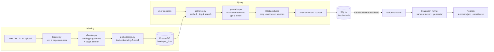

# Developer Documentation Assistant

**A retrieval-augmented generation (RAG) assistant that answers questions about your documentation, and only from your documentation, with a verifiable citation for every claim.**


Upload PDF, Markdown, or text documentation, index it in a local vector
database, and ask questions in a chat interface. Each answer is grounded in
the retrieved passages and cites them inline (`[Source 1]`). You can open each
source to see the file, page, chunk, and excerpt behind it. When the documents
don't contain the answer, the assistant says so instead of guessing.

The RAG loop is only part of the project. It also collects user feedback and
ships an **evaluation harness**: a golden dataset, retrieval and answer
metrics, and a committed baseline report. With these, you can measure a
change instead of guessing whether it helped.

---

## Contents

- [Highlights](#highlights)
- [Example](#example)
- [Architecture](#architecture)
- [Quick start](#quick-start)
- [Using the app](#using-the-app)
- [Evaluation](#evaluation)
- [Testing](#testing)
- [Security and privacy](#security-and-privacy)
- [Design decisions](#design-decisions)
- [Project structure](#project-structure)
- [Limitations and roadmap](#limitations-and-roadmap)
- [Reference](#reference)

---

## Highlights

| Area | What it does |
| --- | --- |
| **Grounded answers** | The model sees only the retrieved context. When that context doesn't support an answer, it returns a fixed fallback message. |
| **Verifiable citations** | Inline `[Source N]` markers are matched to real retrieved chunks. Citations to sources that were never retrieved are removed, and the removal is reported. |
| **Honest metadata** | Filename, page, section, and chunk id come from ChromaDB metadata, never from the model. Missing fields are left out rather than invented. |
| **Safe indexing** | Uploads are validated before processing. Embedding happens only when you click a button. Duplicates (by document id or SHA-256 content hash) are skipped, never overwritten. |
| **Feedback loop** | Each answer gets a 👍/👎 rating with an optional comment. Ratings are stored in SQLite and keyed by a stable per-answer UUID. |
| **Evaluation harness** | 23 golden cases are scored with Hit@k, MRR, keyword coverage, citation precision, grounding, and abstention. An optional LLM judge is available. Every run writes a JSON/CSV report and can enforce CI-style thresholds. |
| **Tested offline** | 260 unit tests mock OpenAI and ChromaDB, so they run in about 10 seconds with no API key and no cost. |

## Example

These are real results from the committed baseline run. The document is a
4-page PDF schedule for a roller-skating championship.

**Question:** *What is the youngest age group in the schedule, and which race formats do they have?*

```text
The youngest age group in the schedule is 6 to 8. They have 3 Lap races,
1 Lap + D races, and 2 Lap + D races, in both Boys Inline/Girls Inline and
Boys Quad/Girls Quad formats [Source 1] [Source 4] [Source 5].
```

| # | Chunk | Page | Distance | Cited |
| --- | --- | --- | --- | --- |
| 1 | `speed_schedule_1_p2_c3` | 2 | 0.882 | ✓ |
| 2 | `speed_schedule_1_p1_c0` | 1 | 0.914 | |
| 3 | `speed_schedule_1_p2_c4` | 2 | 0.944 | |
| 4 | `speed_schedule_1_p4_c11` | 4 | 0.998 | ✓ |
| 5 | `speed_schedule_1_p3_c8` | 3 | 1.013 | ✓ |

The answer combines facts from three pages. All three cited chunks are in the
golden dataset's expected sources.

**Question:** *What is the entry fee for the speed events?* (The document never says.)

```text
I could not find this information in the uploaded documents.
```

## Architecture



The application has three layers:

- **`rag/`**: the pipeline itself (load, chunk, embed, store, retrieve, generate). It has no UI code.
- **`ui/`**: the Streamlit interface. Pages talk only to `ui/services.py`, which wraps the pipeline and turns every exception into a short, user-safe message. The UI never calls OpenAI, ChromaDB, or SQLite directly.
- **`evaluation/`** and **`services/`**: evaluation and feedback. The evaluation runner calls the *same* `retrieve_chunks` and `generate_answer` functions the app uses, so it measures the real system and not a copy of it.

### Tech stack

| Component | Choice |
| --- | --- |
| Language | Python 3.13 |
| UI | Streamlit 1.64 (multipage navigation, chat, status components) |
| Vector store | ChromaDB 1.5, persistent local collection |
| Embeddings | OpenAI `text-embedding-3-small` |
| Generation | OpenAI `gpt-5.4-mini` via the Responses API |
| PDF parsing | pypdf |
| Validation | Pydantic 2 |
| Feedback store | SQLite (standard library) |
| Tests | `unittest`, Streamlit `AppTest` |

## Quick start

**Prerequisites:** Python 3.13 and an OpenAI API key.

```bash
git clone https://github.com/pankajr03/developer-documentation-rag-assistant.git
cd developer-documentation-rag-assistant
python -m venv .venv
```

Activate the virtual environment and install dependencies:

```powershell
# Windows (PowerShell)
.\.venv\Scripts\Activate.ps1
pip install -r requirements.txt
```

```bash
# macOS / Linux
source .venv/bin/activate
pip install -r requirements.txt
```

Create a `.env` file in the project root. It is git-ignored, so never commit it.

```text
OPENAI_API_KEY=sk-...
```

Run the app:

```bash
streamlit run app.py
```

Open <http://localhost:8501>. If the key is missing, the app still starts and
shows a warning. Only indexing and asking need the key.

**First run:** go to **Manage Documents**, upload a PDF or Markdown file,
click **Index selected documents**, then ask a question on **Ask
Documentation**.

## Using the app

The sidebar holds navigation, knowledge-base status, the model names,
retrieval settings, and **Clear conversation**.

| Page | Purpose |
| --- | --- |
| **Ask Documentation** | Chat with cited answers. Each source appears in an expander showing the file, page, section, chunk id, distance, and an excerpt of up to 400 characters. Sources the answer cites are marked **· cited**. |
| **Manage Documents** | Upload and index documents, with progress (*Reading → Chunking → Embedding → Saving*) and a per-file result table. Also lists indexed documents and has a guarded **Reset** action. |
| **Feedback** | A read-only summary of ratings: totals, the helpful percentage, and the most recent ratings. |
| **Evaluation** | A read-only viewer for evaluation reports: key metrics, weak cases, a per-category breakdown, and report downloads. |

**Documents.** PDF, UTF-8 text, and Markdown are supported, up to 10 MB per
file and 10 files per batch. Scanned PDFs without a text layer are skipped
with a clear message. To re-index a document, reset the collection under
**Maintenance** (a confirmation checkbox is required) and upload it again.
Reset deletes indexed chunks only, not feedback or reports.

**Retrieval.** *Chunks to retrieve* (1–10, default 3) affects the chat only.
Evaluation runs use their own configuration.

**Answers are cached per session.** Opening a source or rating an answer
never triggers another model call.

<details>
<summary><strong>Common messages and what to do</strong></summary>

| Message | What to do |
| --- | --- |
| *No documentation is indexed yet* | Index a document on Manage Documents. |
| *The OpenAI API key is missing* | Add `OPENAI_API_KEY` to `.env` and restart. |
| *OpenAI rejected the API key* | Check the key in `.env`. |
| *OpenAI is rate-limiting requests, or the account has no credits left* | Wait, or check billing. |
| *The request to OpenAI timed out* / *Could not reach OpenAI* | Check the network and retry. |
| *The document database (ChromaDB) could not be opened* | Check `data/chroma`, then restart the app. |
| *Could not extract text from this file* | The PDF is damaged or encrypted. |
| *The text file is not UTF-8 encoded* | Re-save the file as UTF-8. |
| *Could not reach the feedback database* | Check that `data/feedback.db` is not locked. |

</details>

## Evaluation

Retrieval quality and answer quality fail for different reasons, so the
harness measures them separately:

- **Retrieval evaluation**: did the search find a chunk that contains the answer? It needs only embeddings, and it's cheap and deterministic for a fixed index.
- **Answer evaluation**: given those chunks, did the model answer correctly, cite correctly, and refuse when it should?

Good retrieval with a bad answer points at the prompt or the model. Bad
retrieval points at chunking, embeddings, or `top_k`.

Only the **question** reaches the pipeline. Expected answers, keywords, and
source ids are used for scoring afterwards, so the model can never see the
answer key. A test enforces this. Evaluation runs only *read* ChromaDB.

### Baseline results

The baseline was recorded on 2026-09-28 with no tuning. The index held 13
chunks of one PDF, with `top_k` 5 and `gpt-5.4-mini`. The full report is in
[`reports/baseline/`](reports/baseline/).

| Metric | Value |
| --- | --- |
| Cases (answerable / unanswerable) | 23 (18 / 5), 0 errors |
| Source hit rate (Hit@5) | **1.000** |
| Hit@1 / Hit@3 | 0.500 / 0.667 |
| MRR | 0.640 |
| Keyword coverage | 0.799 |
| Citation precision | **1.000** |
| Expected-source citation hit | 0.833 |
| Correct abstention rate | **1.000** (5 / 5) |
| Incorrect abstentions | 1 |
| Avg latency (retrieval / total) | 474 ms / 1966 ms |

**What the baseline shows:**

- The right chunk is always retrieved, but ranking is weaker than recall. Table-heavy chunks for race-distance questions often land at rank 4 or 5 (MRR 0.24 in that category).
- One answerable question (`eval_006`) was refused even though the right chunk ranked first. Answering it requires combining two facts (3 × 200 m = 600 m).
- Every citation pointed at a retrieved chunk, and every unanswerable question was correctly refused.

### Running an evaluation

```powershell
# Full run: retrieval + answers (one embedding call and one generation call per case)
python scripts/run_rag_evaluation.py --top-k 5

# Retrieval only (no generation cost)
python scripts/run_rag_evaluation.py --skip-generation

# Subsets
python scripts/run_rag_evaluation.py --category race_distances --max-cases 3
python scripts/run_rag_evaluation.py --case-id eval_006 --case-id eval_019

# Quality gate: exit code 1 if a threshold is missed
python scripts/run_rag_evaluation.py --recommended-thresholds
python scripts/run_rag_evaluation.py --fail-below-mrr 0.6 --fail-below-abstention 0.8

# Add a model-based judge (doubles the API cost)
python scripts/run_rag_evaluation.py --use-llm-judge
```

Each run writes `reports/evaluation/<timestamp>/` with four files:
`summary.json`, `results.jsonl`, `results.csv`, and `failures.jsonl`. Exit
codes: **0** pass, **1** threshold missed or too many case errors, **2**
could not run (bad configuration, missing dataset, or empty index).

To compare a change with the baseline, rerun the same command and diff the
`metrics` in the two `summary.json` files. Change one thing at a time.

### Golden dataset

[`data/evaluation/golden_dataset.jsonl`](data/evaluation/golden_dataset.jsonl)
holds one JSON case per line and is validated by a Pydantic model
(`EvaluationCase`). Unknown fields, duplicate ids, and answerable cases
without expected sources are rejected, and each error is reported with its
line number.

```powershell
python scripts/validate_evaluation_dataset.py               # exit 0 = PASS, 1 = FAIL
python scripts/validate_evaluation_dataset.py --check-index # also confirm chunk ids exist
```

Thumbs-down feedback can be exported as *unreviewed* candidate cases:

```powershell
python scripts/export_feedback_candidates.py --output data/evaluation/feedback_candidates.jsonl
```

The export opens the feedback database read-only. It never exports answers,
excerpts, or session ids, and it never writes to the golden dataset. A human
must decide the correct answer and write the case by hand.

## Testing

```powershell
python -m unittest discover -s tests -t . -p "test_*.py" -v
```

The suite has 260 tests. OpenAI and ChromaDB are mocked, feedback tests use a
temporary SQLite file, and UI tests use Streamlit's `AppTest`. Nothing
touches the network, your index, or your feedback database.

Run a subset:

```powershell
python -m unittest tests.test_generator -v
python -m unittest tests.test_evaluation_metrics tests.test_evaluation_runner -v
python -m unittest tests.test_ui_services tests.test_ui_app -v
```

## Security and privacy

The app is designed for local, single-user use, and it treats document
content as untrusted input.

- **Uploads:** type, size, and emptiness are checked before any processing. The size limit is also enforced in `.streamlit/config.toml`. Files are processed in memory. The browser-supplied filename is sanitized and is never used as a filesystem path.
- **Rendering:** document text is displayed literally or with Markdown escaped, and raw HTML is never enabled. Image embeds in answers are reduced to their alt text, so a malicious document can't make the browser load an external URL.
- **Reports:** report folders are chosen from an allow-list, and resolved paths must stay inside the report directories, which blocks path traversal.
- **Errors and logs:** users see fixed messages. Logs record only exception type names, never API keys, exception text, or document content.
- **SQL:** every query is parameterized.
- **Feedback data:** stored locally and never sent anywhere. Fields are copied from an allow-list and truncated (excerpts to 500 characters, comments to 1,000). API keys, embeddings, and whole documents are never stored. Delete `data/feedback.db` to erase all feedback.

## Design decisions

- **Citations come from structured data, not from text search.** The generator numbers the retrieved chunks, parses the `[Source N]` markers, and returns a `citations` list. A citation to a number that was never retrieved is removed from the answer and recorded in `unverified_citation_numbers`.
- **The fallback is a fixed string.** Refusal can be detected exactly, which makes abstention measurable.
- **Evaluation reuses production code.** There is no separate evaluation pipeline, so a change to the app is automatically reflected in its scores.
- **Deterministic metrics come first, and the LLM judge is optional.** The judge costs more, can vary between runs, and when it is the same model as the generator it may be lenient toward its own answers. Its scores never change the deterministic metrics.
- **Relevance uses exact id matching.** A retrieved chunk counts as relevant only if its `chunk_id` equals an expected id. There is no substring matching, so `doc_p1_c1` never matches `doc_p1_c12`.
- **Paid API calls are explicit.** Embedding runs only on a button click, and answers are cached in session state, so Streamlit's frequent reruns never re-bill.
- **Dependencies are kept minimal.** Streamlit already provided navigation, chat, and status components, so the UI overhaul added no new packages.

## Project structure

```text
developer-doc-assistant/
├── app.py                    Streamlit entry point (navigation only)
├── rag/                      The RAG pipeline
│   ├── loader.py             TXT / Markdown / PDF text + page metadata
│   ├── chunker.py            overlapping chunks, keeps page and heading
│   ├── embeddings.py         OpenAI embeddings, API key loading
│   ├── vector_store.py       ChromaDB storage, chunk ids, dedup, reset
│   ├── retriever.py          top-k similarity search with metadata
│   └── generator.py          numbered sources, grounded answer, citations
├── ui/                       Streamlit interface
│   ├── services.py           boundary to the pipeline, user-safe errors
│   ├── state.py              chat and feedback session state
│   ├── validation.py         question/upload validation, filename sanitizing
│   ├── formatting.py         source display, excerpts, safe Markdown
│   ├── reports.py            read-only, path-safe report access
│   ├── components.py         shared widgets and sidebar
│   ├── config.py             limits and defaults
│   └── pages/                ask, documents, feedback, evaluation
├── services/
│   └── feedback_service.py   SQLite feedback store (upsert, summary)
├── evaluation/
│   ├── schemas.py            EvaluationCase (Pydantic)
│   ├── dataset.py            load and validate the golden dataset
│   ├── candidates.py         feedback → unreviewed candidates
│   ├── config.py             EvaluationConfig, thresholds, fallback phrases
│   ├── metrics.py            deterministic retrieval and answer metrics
│   ├── judge.py              optional LLM judge
│   ├── results.py            CaseResult, MetricSummary
│   ├── runner.py             run_evaluation()
│   └── reporter.py           summary.json, results.jsonl/.csv, failures.jsonl
├── scripts/                  CLIs: evaluate, validate, export candidates, view feedback
├── tests/                    260 offline unit tests
├── data/evaluation/          golden_dataset.jsonl (committed)
├── reports/baseline/         baseline evaluation report (committed)
└── requirements.txt
```

These paths are created at runtime and git-ignored: `data/chroma/` (vector
index), `data/feedback.db`, `reports/evaluation/`, and `.env`.

## Limitations and roadmap

**Current limitations**

- There is no authentication, so the app is intended for `localhost` only.
- Chunking is character-based, so a chunk can start mid-sentence.
- Section names are detected from Markdown headings only. PDF chunks usually have no section.
- There is no relevance threshold: every retrieved chunk is listed as a source (cited ones are marked).
- Re-indexing a single document requires resetting the whole collection.
- Chat history lives in the browser session and is lost on refresh.
- Indexing runs inside the Streamlit request, so a large PDF blocks the tab until indexing finishes.
- Feedback is per answer, not per source.

**Next steps.** Each will be measured against the baseline:

- [ ] Add a relevance threshold to filter weakly matching chunks.
- [ ] Support deleting and re-indexing one document at a time.
- [ ] Chunk on sentence or paragraph boundaries.
- [ ] Detect section headings in PDFs.
- [ ] Improve ranking for table-heavy chunks (race-distance MRR) and multi-fact answers (`eval_006`).

## Reference

<details>
<summary><strong>Chunk metadata stored in ChromaDB</strong></summary>

| Field | Source | Notes |
| --- | --- | --- |
| `source` | uploaded filename | always present |
| `document_id` | slug of the filename | e.g. `speed_schedule_1` |
| `chunk_id` | `{document_id}_p{page}_c{chunk_index}` | also the record's Chroma id |
| `chunk_index` | position in the document | counts across the whole file |
| `page` | PDF page number (1-based) | omitted for TXT and Markdown |
| `section` | nearest Markdown heading | omitted when there is none |
| `content_hash` | SHA-256 of the document | used to detect duplicates |

Chunks indexed by early versions lack `page` and `chunk_id`. Reset the
collection and upload those documents again.

</details>

<details>
<summary><strong>Evaluation metric definitions</strong></summary>

- **Source hit / Hit@k (k = 1, 3, 5):** 1 if a relevant chunk appears in the top k results. The value is `null` when fewer than k results were requested.
- **MRR:** the mean of `1 / rank` of the first relevant chunk (0 if none is found). It rewards putting the right chunk *first*.
- **Keyword coverage:** matched expected keywords divided by total expected keywords. Matching is case-insensitive and on whole words or phrases only (`with` does not match `without`).
- **Citation precision:** citations that point at a retrieved chunk, divided by all citations, micro-averaged across cases.
- **Expected-source citation hit:** the answer cites at least one expected chunk.
- **Grounded:** a non-fallback answer that cites only retrieved chunks. This is citation-level grounding. It does not prove that every sentence is supported.
- **Correct abstention:** on an unanswerable case, the answer contains the fallback phrase and cites nothing. An abstention on an answerable case is counted as *incorrect*.
- **LLM judge (optional):** correctness, grounding, and relevance, each scored 0–4, plus `unsupported_claims`. The output is structured and validated with Pydantic.

Deterministic metrics check wording and ids, not truth. An answer can contain
every keyword and still be wrong, and a citation to a retrieved chunk doesn't
prove the chunk supports the claim.

</details>

<details>
<summary><strong>Golden dataset fields</strong></summary>

| Field | Required | Meaning |
| --- | --- | --- |
| `id` | yes | stable unique id, e.g. `eval_001`; never reused |
| `question` | yes | the user question |
| `expected_answer` | yes | short reference answer, or the safe behavior for unanswerable cases |
| `expected_keywords` | yes | concepts a good answer mentions; may be `[]` |
| `expected_source_ids` | yes | chunk ids that support the answer; `[]` when unanswerable |
| `category` | yes | subject area, e.g. `race_format` |
| `difficulty` | yes | `beginner`, `intermediate`, or `advanced` |
| `answerable` | yes | JSON boolean |
| `expected_source_titles`, `notes`, `tags`, `metadata` | no | extra context |

```json
{"id": "eval_005", "question": "How long is one lap according to the schedule?", "expected_answer": "One lap is the length of a 200m rink, as per RSFI guidelines.", "expected_keywords": ["1 lap", "200m", "rink", "RSFI"], "expected_source_ids": ["speed_schedule_1_p1_c2", "speed_schedule_1_p2_c5"], "category": "race_format", "difficulty": "beginner", "answerable": true}
```

</details>

<details>
<summary><strong>Feedback database schema</strong></summary>

```sql
CREATE TABLE feedback (
    id INTEGER PRIMARY KEY AUTOINCREMENT,
    response_id TEXT NOT NULL UNIQUE,
    session_id TEXT,
    question TEXT NOT NULL,
    answer TEXT NOT NULL,
    rating INTEGER NOT NULL CHECK (rating IN (1, -1)),
    comment TEXT,
    sources_json TEXT,
    retrieved_chunks_json TEXT,
    model_name TEXT,
    retrieval_top_k INTEGER,
    created_at TEXT NOT NULL,
    updated_at TEXT
)
```

Saving uses `INSERT ... ON CONFLICT(response_id) DO UPDATE`, so each answer
has exactly one row. `retrieved_chunks_json` stores metadata only, never
chunk text. To inspect ratings from the command line, run
`python scripts/view_feedback.py --limit 20`.

</details>

<details>
<summary><strong>Models</strong></summary>

| Purpose | Model | Configured in |
| --- | --- | --- |
| Embeddings | `text-embedding-3-small` | `rag/embeddings.py` (`MODEL_NAME`) |
| Answer generation | `gpt-5.4-mini` | `rag/generator.py` (`MODEL_NAME`) |
| Evaluation judge (optional) | `gpt-5.4-mini` | `evaluation/judge.py`, or `--judge-model` |

</details>

<details>
<summary><strong>How it was built</strong></summary>

The project was built in small, reviewed stages, each adding one capability:

1. Document loader for TXT, Markdown, and PDF
2. Chunking with overlap
3. Embeddings and a local vector store
4. Question retrieval
5. Persistent ChromaDB storage
6. Grounded answer generation
7. Citations with page and chunk metadata
8. Thumbs-up/down feedback in SQLite
9. Golden evaluation dataset and validator
10. Automated evaluation with a committed baseline
11. Multipage Streamlit interface
12. Portfolio-ready documentation

</details>
